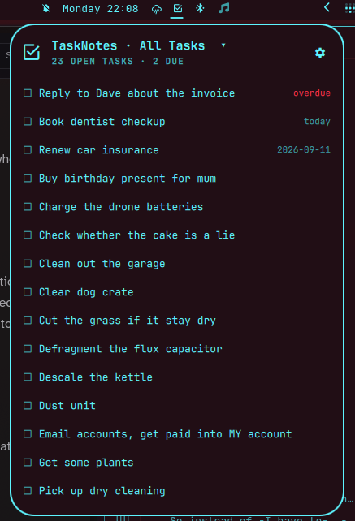

# OmaTaskNotes

[TaskNotes](https://tasknotes.dev/) tasks from an Obsidian vault, in the
Omarchy bar: an icon that lights while something is open, a popup to work
through them, and a picker for whichever TaskNotes **view** you want to see
(Today, Overdue, This Week, a saved view -- anything TaskNotes itself can
show as a list).

This is a TaskNotes-aware sibling to
[m1kode/obsidian-tasks](https://github.com/m1kode/obsidian-tasks), which
reads the simpler Obsidian *Tasks* plugin's checkbox syntax. TaskNotes stores
each task as its own note with YAML frontmatter, and its views are defined
using Obsidian's native "Bases" format -- different enough to need its own
widget.



## How it's meant to be used

The vault is the only state -- no database, no account, no cache beyond one
scan's results:

- **Capture anywhere, tick off here.** Add tasks in Obsidian, on your phone,
  wherever; they reach the bar as soon as sync lands them.
- **Pick the view that matches how you actually work.** TaskNotes' own
  "Views" menu in Obsidian is where you already define Today / Overdue / This
  Week / a custom saved view -- this widget lists whatever's there and lets
  you choose one, rather than inventing its own filtering.
- **This is a view, not the system of record.** Obsidian and this widget are
  equally valid ways to change a task. Nothing here owns the data, and it
  never touches any note outside TaskNotes' own tasks folder.

## Install

```bash
omarchy plugin add https://github.com/Doghouse-Mike/omatasknotes.git --enable
omarchy bar put doghouse-mike.omatasknotes --section center
```

Requires `python3` and **`python-yaml`** (`pacman -S python-yaml`) --
TaskNotes' views are real YAML (Obsidian's "Bases" format), and getting that
parsing right needs an actual YAML parser rather than a hand-rolled one. If
it's missing, the widget says so plainly rather than guessing.

To remove it:

```bash
omarchy plugin remove doghouse-mike.omatasknotes
```

That takes the widget out of the bar and deletes the plugin. Your vault is
untouched -- the plugin only ever reads and writes inside the TaskNotes
folder you already configured, and removing it leaves every task exactly
where it is.

## First run

The popup opens with a vault-path field, pre-filled with the vault Obsidian
currently has open (read from its registry, `~/.config/obsidian/obsidian.json`
or the Flatpak/Snap equivalents) -- a suggestion, not a decision made for
you. Enter accepts it, or type your own.

Once a vault with TaskNotes configured is found, the same panel lists every
view TaskNotes knows about (both the ones defined in `.base` files under
`TaskNotes/Views/`, and any saved view from TaskNotes' own settings). Pick
one; it's remembered the same way the vault path is.

Or set both from the shell and skip the prompts:

```bash
omarchy bar set doghouse-mike.omatasknotes vaultPath /path/to/your/vault
omarchy bar set doghouse-mike.omatasknotes viewId "base:TaskNotes/Views/tasks-default.base::Today"
```

Changing a setting this way needs `omarchy restart shell` to take effect;
picking a view from the popup itself takes effect immediately.

## Views: what's supported, and what isn't

TaskNotes' views (Today, Overdue, a Kanban board, a calendar, ...) are built
on Obsidian's "Bases" format, which is a real small expression language --
`file.hasTag(...)`, date arithmetic, list operations, and formulas that can
reference other tasks. This widget deliberately does **not** implement all
of it. It faithfully evaluates:

- tag checks, and equality/inequality on any field (status, priority, ...)
- emptiness/truthiness checks (`recurrence.isEmpty()`, bare `recurrence`, ...)
- the recurring-task "done for today" idiom
  (`complete_instances.contains(today().format(...))`)
- date comparisons against `today()`, with day offsets
- TaskNotes' own shipped default formulas by name (`priorityWeight`,
  `urgencyScore`, and friends), matched against their known-good expression
  text -- if you've customised one, the view it's used in is treated as
  unrecognised rather than silently miscomputed
- any view type that isn't a plain task list (Kanban board, calendar,
  pomodoro stats, ...) isn't shown here at all -- a bar popup can't render
  those meaningfully as a flat list

Anything else -- a view that looks up another task's status (like the
shipped "Not Blocked" view), a time-tracking formula, or any construct this
widget doesn't recognise -- is marked **(unsupported)** in the picker and
can't be selected. That's a deliberate refusal, not a bug: getting a task
list quietly wrong is worse than saying "can't do this one yet."

The saved views defined in TaskNotes' own settings (its simpler
property/operator/value query builder) are always supported -- they use a
much smaller, unambiguous format.

## Sync

Nothing here touches a network by default. The widget reads and writes
frontmatter in a folder; keeping that folder current is someone else's job
(Obsidian Sync, Syncthing, git, whatever you already use).

If TaskNotes' own local HTTP API happens to be enabled (Settings ->
TaskNotes -> Integrations -> HTTP API) and Obsidian is running, ticking a
task also nudges the API after writing the file -- a best-effort extra,
never required, and never the source of truth. The file write always happens
first and is what actually decides the result; the API is silently skipped
if Obsidian isn't open or doesn't answer within about a second and a half.

Because sync can rewrite a file at any moment, every write is a compare-and
-swap on a hash of the frontmatter block: if that block changed since the
scan that drew a row, the write is a no-op rather than a guess. Writes are
also atomic (written to a temp file in the same folder, then renamed into
place) so a crash mid-write can never leave a half-written task behind.

The vault is rescanned every 60s and whenever the popup opens.

## Interactions

Click the checkbox to complete/uncomplete a task. Right-click a task's title
to open its note directly in Obsidian, via Obsidian's own built-in `obsidian://open`
URI (no Advanced URI plugin needed) -- useful for anything the popup itself
doesn't expose, like renaming a task or editing its body.

## Settings

From the widget's entry in `~/.config/omarchy/shell.json`:

| Key | Default | What it does |
|---|---|---|
| `vaultPath` | *(auto)* | Vault folder; empty means ask Obsidian |
| `viewId` | *(none)* | Which TaskNotes view to show; set from the popup's picker |
| `countMode` | `all` | `all` lights the icon for any open task; `due` only for today or earlier |
| `refreshIntervalSec` | `60` | Rescan interval |

Only the vault's `tasksFolder` (as configured in TaskNotes' own settings) is
ever scanned or written to -- not the whole vault, and not the archive
folder.

## Not yet supported

- Renaming a task from the popup (right-click it to open the note in Obsidian and retitle it there).
- Natural-language dates in the quick-add box -- it only sets a title for
  now; set the due date in Obsidian afterwards.
- Views whose type isn't a flat list (Kanban, calendar, ...), or whose
  filter/sort uses a construct outside the list above -- see "Views" above.

## How it works

`Panel.qml` decides what to show; `bin/omatasknotes` does every read and
write. It only ever touches files inside TaskNotes' configured tasks folder,
never re-serialises a whole frontmatter block (only the one field's own
line-range is replaced, so nothing else in the file's formatting changes),
and never evaluates a filter/formula it doesn't recognise exactly.


## If you find this useful, and can spare the cash:

<a href='https://ko-fi.com/Y8Y41LC22H' target='_blank'></a>

I'll blow it on some combination of bike parts, nerd things, cameras, and music gear. Or food. [Food is good. ](https://www.youtube.com/watch?v=8bpTejGazqk)
